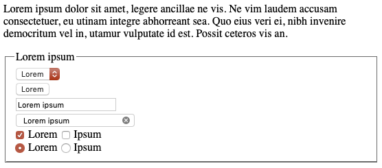
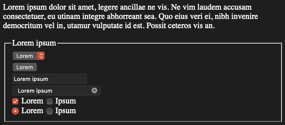
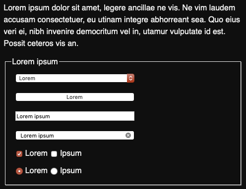
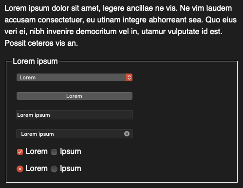

The [Release Notes of Safari Technology Preview 71](https://webkit.org/blog/8517/release-notes-for-safari-technology-preview-71/) mentioned two new dark mode features:

> • Added experimental support for a `supported-color-schemes` CSS property ([r238001](https://trac.webkit.org/changeset/238001/webkit/)).  
> • Changed the default document background and text colors in dark mode and when `dark` is listed as a `supported-color-schemes` on the document or body element ([r238212](https://trac.webkit.org/changeset/238212/webkit/)).

These were renamed to just `color-scheme` in [Technology Preview 81](https://webkit.org/blog/8834/release-notes-for-safari-technology-preview-81/):

> • Renamed `supported-color-schemes` to `color-scheme` ([r244408](https://trac.webkit.org/changeset/244408/webkit/))  
> • Standardized the `<meta name="color-scheme">` separator ([r244413](https://trac.webkit.org/changeset/244413/webkit/))

This is actually talking about a new **meta tag** `<meta name="color-scheme">` and a **CSS property** `color-scheme` that were both proposed in [a CSS WG GitHub issue](https://github.com/w3c/csswg-drafts/issues/3299) (under the old name `supported-color-schemes`), but the meta tag is now being standardized in the [WHATWG](https://github.com/whatwg/html/issues/4504).

#### User-Agent stylesheets

💡 Before I continue, let me briefly describe what a **user-agent stylesheet** is: a user-agent (UA for short) stylesheet determines the default look and feel of a page. As the name suggests, a UA stylesheet is something that is dependent on the UA in question. You can have a look at [Chrome’s (and Chromium’s) UA stylesheet](https://chromium.googlesource.com/chromium/blink/+/master/Source/core/css/html.css) and compare it to [Firefox’s](https://dxr.mozilla.org/mozilla-central/source/layout/style/res/html.css) or [Safari’s (and WebKit’s)](https://trac.webkit.org/browser/trunk/Source/WebCore/css/html.css). Typically, all UA stylesheets agree and make texts black and background colors white, but there are also differences, for example, how to display form controls. Side remark: To overcome these differences, CSS normalizers and CSS resets have become a thing (read this [article](http://nicolasgallagher.com/about-normalize-css/) about the difference).

So let’s have a closer look at [WebKit’s user-agent stylesheet](https://trac.webkit.org/browser/trunk/Source/WebCore/css/html.css) and what it does regarding dark mode (do a full text search for “dark” in the code). It changes the UA stylesheet’s default values based on whether dark mode is on or off. To illustrate this, here’s one such CSS rule (using the `[:matches](https://css-tricks.com/almanac/selectors/m/matches/)` pseudo class and WebKit-internal variables like `-apple-system-control-background,` as well as the WebKit-internal preprocessor directive `#if defined`):

input,  
input:matches(\[type="password"\], \[type="search"\]) {  
  -webkit-appearance: textfield;  
  #if defined(HAVE\_OS\_DARK\_MODE\_SUPPORT) &&  
      HAVE\_OS\_DARK\_MODE\_SUPPORT  
    color: text;  
    background-color: -apple-system-control-background;  
  #else  
    background-color: white;  
  #endif  
  \[…\]  
}

So looking at a concrete example, it changes this light mode experience…

Default rendering in light mode

…to this dark mode experience…

Default rendering in dark mode

Note that there is _no_ custom CSS at all included, let alone the `@media (prefers-color-scheme)` media query. The above is purely based on the UA stylesheet.

#### The meta tag `<meta name="color-scheme"> and the CSS property "color-scheme"`

Now back to the meta tag and the CSS property (that has the same behavior as the meta tag, but optionally limited to just subsections of a page). They both mean that UAs know early in parsing which color scheme is to be used, since this may impact the default appearance, for example, when rendering the default page background, form controls, the default selection color, but also other UA-controlled UI like misspelling underlines. In consequence, this avoids flashes caused by delayed switches between color schemes.

Here are some of the values the meta tag and the CSS property can take (quoted from [Simon Fraser](https://github.com/smfr)’s [GitHub Issue text](https://github.com/w3c/csswg-drafts/issues/3299#issue-378507535), _italic_ emphasis mine):

*   `light dark`—The UA will choose the light or dark theme to match the user’s preference. _If the user’s preference does not match something in the list, the UA is allowed to apply transformations to the content_.
*   `only` (synonym for `light only`—The UA will only ever render the content in the light color scheme, _and never apply transformations_.
*   `light dark only`—The UA will choose the first of the listed schemes that it supports taking user preference into account, _and never apply transformations_.

So iff (if, and only if) you know what you’re doing, in combination with `only`, you can then design things like your form controls to have no such transformations. In most cases, leaving it to the UA might be the better choice, as you can see in the example below, where, while in dark mode, I force my form controls to look like `light only`.

Left: glaring and without transformations. Right: the easier-on-the-eyes UA default.

This article was updated to reflect the name change from `supported-color-schemes` (plural) to `color-scheme` (singular).